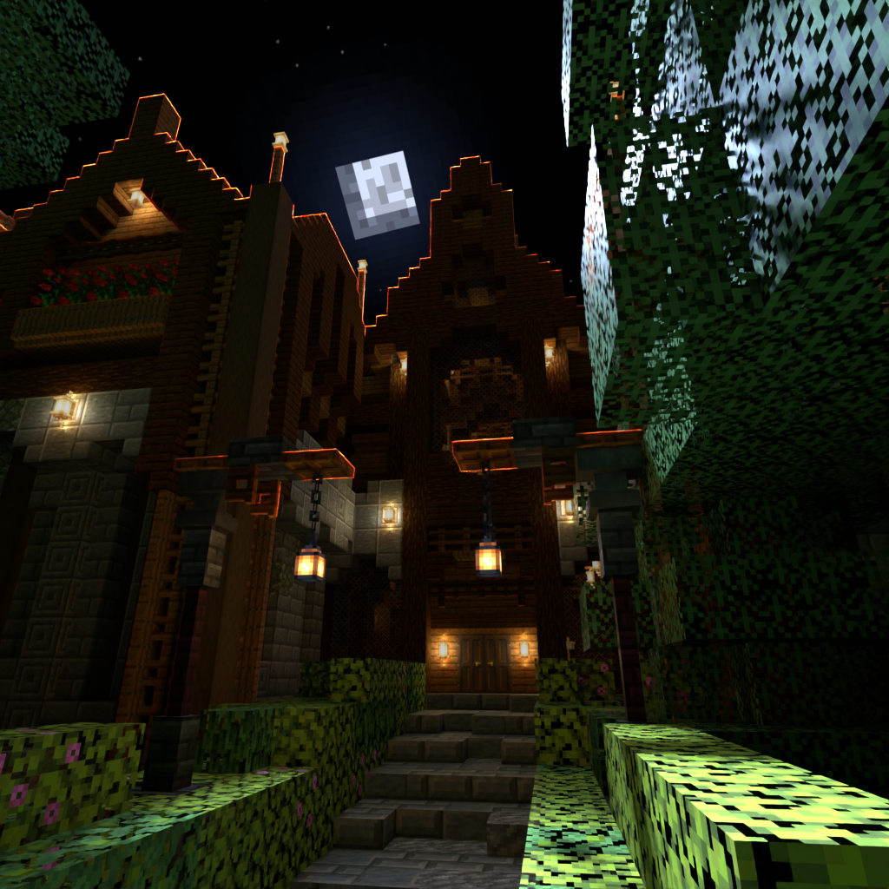

# Duskwood Manor
A mod for the [Wathe](https://modrinth.com/mod/wathe) map Duskwood Manor by somewhat_grand!

## Setup
For setup instructions, please see the [Fabric Documentation page](https://docs.fabricmc.net/develop/getting-started/creating-a-project#setting-up) related to the IDE that you are using.

## Screenshots

